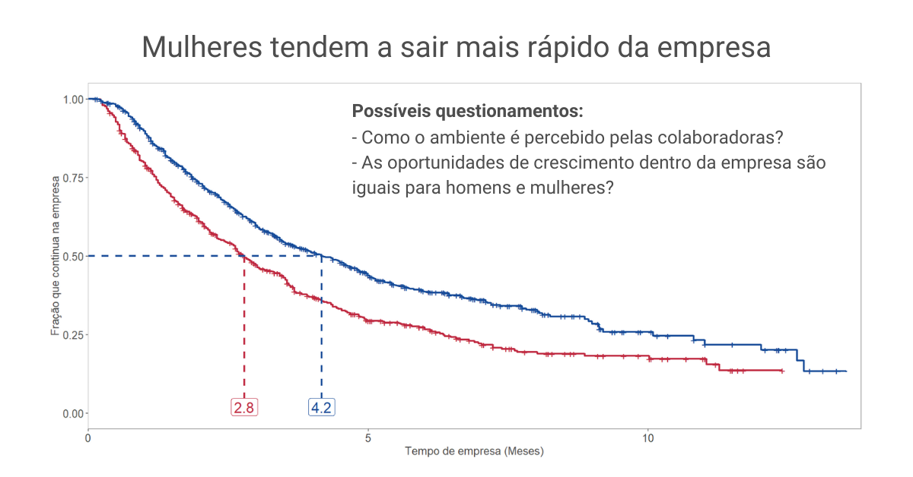

# How to Model and Analyze Time-Dependent Events through Survival Analysis

Survival analysis is an approach originally used in the biological field but can be extremely valuable in various other contexts. It assists in understanding events that involve time, such as employee attrition in a company, the lifespan of a product, customer service abandonment, and student retention in schools.

In simple terms, survival analysis deals with events that occur only once and are time-related. It helps us comprehend the comparative risk of these events in different groups. This is achieved through the 'survival function,' which displays the probability of survival up to a certain point in time.

To conduct this analysis, we start with a snapshot of the initial state of the company, meaning we examine its past and present history. Initially, everyone is 'alive,' so we have 100% of the population present. Then, over time, we calculate how many people or entities in each group are still 'alive.' With these numbers, we can create the survival function and represent it in a graph called the 'Kaplan-Meier Curve.' This graph helps us visualize how the probability of survival changes over time for different groups.

When we apply this analysis and extend the concept to other contexts, we can understand and compare the behavior of groups with different characteristics over time. In People Analytics, for example, the term 'survival' can be understood as remaining with the company, i.e., how variables associated with an individual are related to turnover.

To illustrate, let's investigate an example generated with a turnover dataset available here and with the R code available on my GitHub. In the graph, we have the fraction of employees who continue with the company over time, separated by gender, and the highlighted point indicates how many months it takes for the number of employees in each group to reduce by half. The term 'half-life' is used to denote this value, and through it, we can pinpoint that the female group experiences attrition more rapidly than the male group. With this information, you can investigate the causes of this difference and devise action plans to reduce it. This visualization is an effective way to investigate, understand, and visualize the initial relevance of an input variable regarding survival outcomes.

To delve deeper into the analysis, it is recommended to associate this approach with a Cox proportional hazards regression model. This model assists in determining the statistical significance of input variables and estimating the impact of each of them on comparative risk over the study period. However, the details of this process will be covered in another post!
